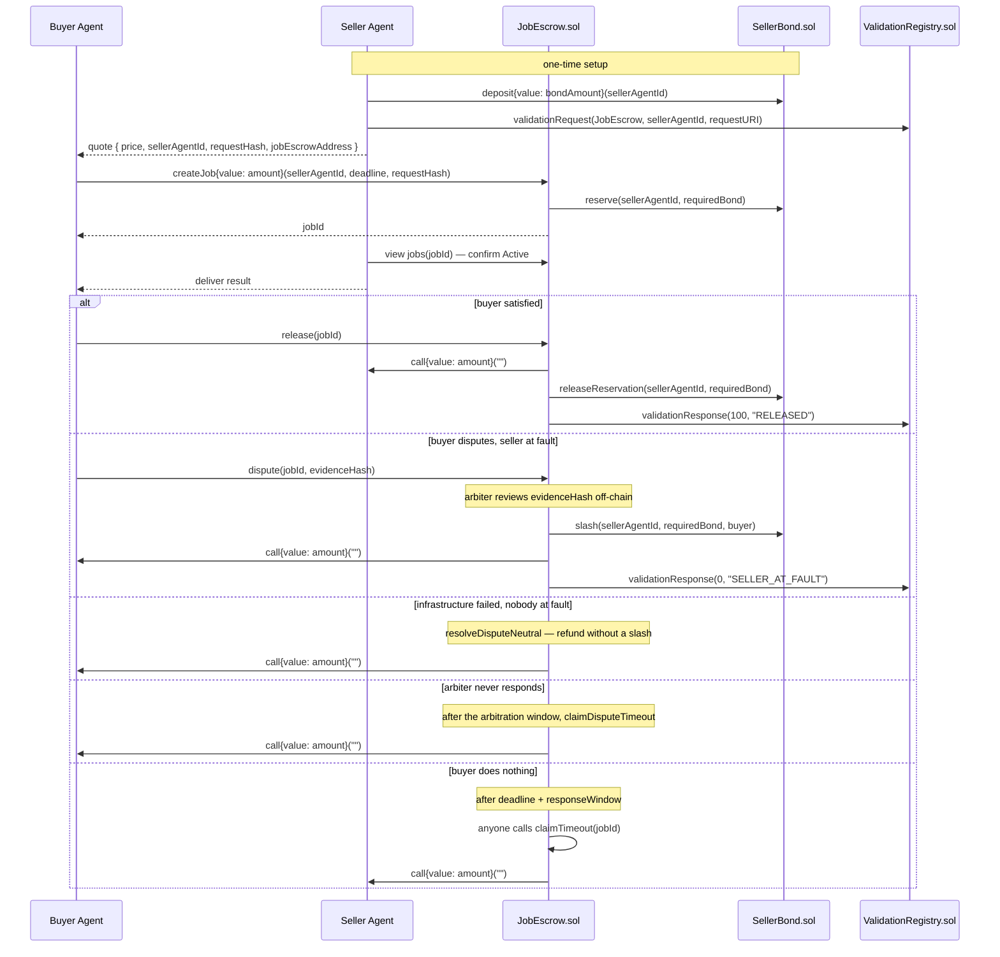

# TripBOT

Escrow-backed job settlement for agent-to-agent payments on **BOT Chain** — payment releases
only on verified delivery, backed by a slashable seller bond. The contracts are deployed to
mainnet; the playable judge session runs against testnet.

Built for the BOT Chain Africa Builder Challenge (AI & AI Agents track). The escrow contracts
were originally written for Circle's Arc testnet during the Encode Club ARC Hackathon and
ported here; that provenance is noted for honesty, but TripBOT has no Arc dependency, no Arc
history, and no Arc identity.

## What this is, in one paragraph

Two AI agents want to trade a service for payment. Today, payment either settles irreversibly
the instant it's sent, or it doesn't move at all — there's no in-between. TripBOT adds that
in-between: a buyer's payment sits in an on-chain escrow contract instead of releasing
immediately, and a seller has to post a slashable bond before they're even eligible to take
the job. If delivery is good, the buyer releases the escrow and the seller gets paid in full.
If it isn't, the buyer disputes, and — once resolved — the seller's own posted stake
compensates the buyer instead of the buyer just losing the money.

## Try it

A judge plays the buyer end to end, funded by a server-side testnet wallet. The browser never
holds a key.

```bash
cd web
cp .env.example .env.local     # fill in wallets, session secret, Supabase
npm install && npm run dev
```

- `/` — what the product argues, with live contract numbers
- `/live` — the funded buyer session

The run **stops at the funding step and asks**, because spending someone's money without
asking is the thing this product exists to argue against. Choose a seller, read the 402-style
quote and its on-chain validation request, approve the exact amount, inspect what arrives, and
then release or dispute. A dispute resolved against the seller pays the buyer twice — the
escrow refund, and the seller's slashed collateral — from two different contracts.

## Architecture



No external dependency can block a payout. Validation Registry calls are wrapped, the registry
integration has an owner-controlled kill switch, a payout that a recipient rejects becomes a
pull-payment credit rather than a revert, and both timeout paths exist so neither an absent
buyer nor an absent arbiter can strand funds.

## Deployments

**BOT Chain mainnet — chain 677.** The contracts are the deliverable, and they are live.

| Contract | Address |
|---|---|
| JobEscrow | `0x627853Ddf094172913f23366839A86DF3d1Aa5bB` |
| SellerBond | `0x3A40b1dd835f271e2E67C5b2AEb82F27D4d5ec5D` |
| IdentityRegistry | `0x9e0F863AE8165688c6e5Ec335236bD459f2DdC8b` |
| ValidationRegistry | `0xA29b9F92Eb6A64B9371F86f80e458743341c6c9F` |

**BOT Chain testnet — chain 968.** Everything the web app reads and writes.

| Contract | Address |
|---|---|
| JobEscrow | `0xe02695454edA18Ec0b00836F98635aC2D6CAA238` |
| SellerBond | `0x56641c18259bDf08dF4b78d14Bb7ECe3a2283A67` |
| IdentityRegistry | `0x66677c64d0545a5F161EAE83fed8D260EAc58cAa` |
| ValidationRegistry | `0x4Dd733cBAcF4A13bD265CCB17B026BD9CdDBb0B0` |

**The funded judge session runs on testnet, deliberately.** The mainnet contracts hold no
demo funds and no visitor-facing path can move value on 677. A public demo that spends from a
server-held wallet is the right shape for testnet play money and the wrong shape for real
funds, so the two are kept apart.

Testnet explorer: [scan.bohr.life](https://scan.bohr.life).

One coincidence that reads like an error and is not: the mainnet addresses are identical to
this project's *first* testnet deployment. Contract addresses derive from deployer and nonce,
and the deployer began at nonce zero on both chains. That first testnet deployment predates
the hardening and is superseded; the app refuses to write to it, and the current testnet stack
is the one in the second table.

## Status

- Contracts complete, 138 unit tests passing, `forge fmt --check` clean.
- Full lifecycle verified on-chain, not only in tests: quote, escrow funding, delivery,
  dispute, and an arbiter ruling that slashed real collateral to the buyer.
- Web app complete: read APIs, funded buyer session, arbiter resolution.
- Contracts deployed and wiring-verified on mainnet (677) and testnet (968).

## Honest disclosures

- **Dispute resolution is single-arbiter (the deployer wallet)** — centralized-for-now, not
  pretend-decentralized.
- **No ERC-8004 registry exists on BOT Chain.** This project deploys its own minimal
  Identity/Validation Registry stand-ins. They are ERC-8004-*inspired*, not a claim of
  compliance, and the identity stand-in does not implement agent transfer.
- **Dispute evidence is hash-only.** The evidence is canonicalised and committed on-chain as a
  hash; EIP-4844 blob anchoring is proven in `contracts/script/` but is not wired into the web
  flow, and the interface says so rather than implying otherwise.
- **The EOA Paymaster path has no sponsor account**, so every transaction self-pays. It is not
  wired into the app.
- **The seller endpoints are archetypes served in-process**, not independent HTTP services.
  Delivery still requires a signature recovering to the job's buyer and is claimed once per job
  in durable storage.
- **The contracts are deployed to mainnet; the funded demo is not.** The judge session spends
  a server-held wallet, which is appropriate for testnet play money and not for real funds,
  so it stays on chain 968. Nothing visitor-facing can move value on 677.
- **Demo wallets are disposable burners.** At demo prices, gas exceeds the buyer's compensation
  — the mechanism pays out exactly as designed, but nobody comes out ahead on a 0.03 BOT job.

## Repo layout

```
README.md            — this file
LICENSE              — Apache-2.0
.github/workflows/   — CI: Foundry build/test/fmt, plus web lint/typecheck/build
contracts/           — Foundry project: JobEscrow + SellerBond + ERC-8004 stand-ins
web/                 — Next.js app: landing page, funded judge session, read APIs
```

## Reference links

- BOT Chain dev docs: dev-docs.botchain.ai
- BOT Chain testnet explorer: scan.bohr.life
- BOT Chain testnet faucet: faucet.botchain.ai/basic
- ERC-8004 spec: eips.ethereum.org/EIPS/eip-8004
