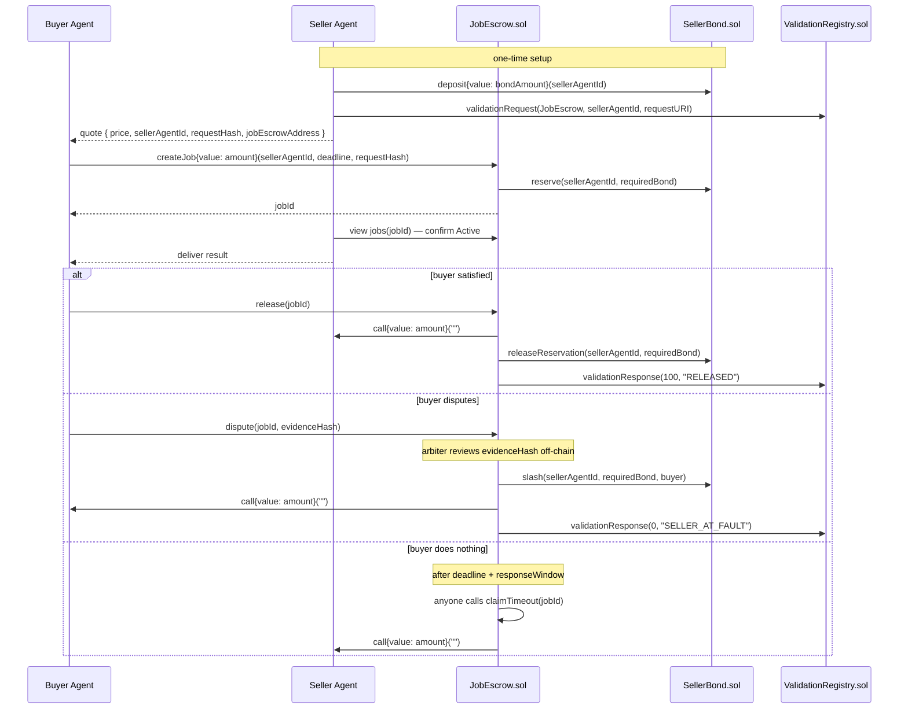

# Tripwire

Escrow-backed job settlement for agent-to-agent payments — payment releases only on verified
delivery, backed by a slashable seller bond.

Originally built for the Encode Club ARC Hackathon (Circle's Arc testnet, Agentic Economy
track), and ported here to **BOT Chain testnet** for the BOT Chain Africa Builder Challenge.

## What this is, in one paragraph

Two AI agents want to trade a service for payment. Today, payment either settles irreversibly
the instant it's sent, or it doesn't move at all — there's no in-between. Tripwire adds that
in-between: a buyer's payment sits in an on-chain escrow contract instead of releasing
immediately, and a seller has to post a slashable bond before they're even eligible to take
the job. If delivery is good, the buyer releases the escrow and the seller gets paid in full.
If it isn't, the buyer disputes, and — once resolved — the seller's own posted stake
compensates the buyer instead of the buyer just losing the money. Two contracts,
`SellerBond.sol` and `JobEscrow.sol`, are the whole mechanism.

## Why this port

The contracts have no dependency on Arc beyond its gas-token quirk (USDC as native value at a
fixed pseudo-ERC20 address) and its specific ERC-8004 registry deployment. BOT Chain testnet
gives the same EVM semantics with a standard native gas token (BOT), plus two capabilities Arc
didn't have: a real EOA Paymaster and a Blob API. See
[`contracts/README.md`](contracts/README.md) for the full technical rundown of what changed.

## Architecture



The contracts live in [`contracts/src/`](contracts/src/) — a Foundry project; see
[`contracts/README.md`](contracts/README.md) for build, test, and network configuration.

## Honest disclosures

- **Dispute resolution is single-arbiter (the deployer wallet) for this hackathon** —
  centralized-for-now, not pretend-decentralized.
- **No ERC-8004 registry exists on BOT Chain testnet.** This project deploys its own minimal
  Identity/Validation Registry stand-ins alongside the escrow contracts (see
  [`contracts/README.md`](contracts/README.md)) rather than relying on a third-party
  deployment, since none currently exists to rely on.
- **Every Validation Registry call is wrapped** so a flaky (or, here, freshly-deployed and
  unbattle-tested) registry can never block a payment from settling — the same defensive
  pattern this project used against Arc's own ERC-8004 deployment.
- **EOA Paymaster and Blob API integration are in progress** — BOT Chain has both; Arc had
  neither. See [`contracts/README.md`](contracts/README.md) for status.
- **This is a testnet-only port.** No mainnet deployment work has been done or is planned as
  part of this submission.

## Status

Both contracts are complete and fully unit-tested (109 tests passing). Previously deployed
and verified on Arc testnet; this port targets a fresh deploy to BOT Chain testnet. See
[`contracts/README.md`](contracts/README.md) for current deployment addresses.

## Repo layout

```
README.md            — this file
LICENSE              — Apache-2.0
.github/workflows/   — CI: forge build/test + lint + typecheck, on every branch
contracts/           — Foundry project: SellerBond.sol + JobEscrow.sol + ERC-8004 stand-ins
```

`arc-nanopayments/` (the Circle-specific Next.js seller app / x402 buyer agent from the
original Arc build) has been removed — this port is contracts-only.

## Reference links

- BOT Chain dev docs: dev-docs.botchain.ai
- BOT Chain testnet explorer: scan.bohr.life
- BOT Chain testnet faucet: faucet.botchain.ai/basic
- BOT Chain DEX: dex.botchain.ai
- ERC-8004 spec: eips.ethereum.org/EIPS/eip-8004
