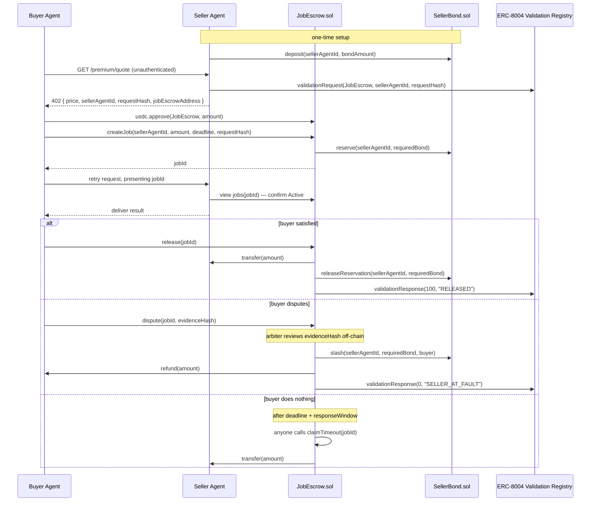

# Tripwire

Escrow-backed job settlement for agent-to-agent USDC payments on Arc — payment releases only
on verified delivery, backed by a slashable seller bond.

Built for the Encode Club ARC Hackathon, **Agentic Economy track**.

## What this is, in one paragraph

Two AI agents want to trade a service for USDC on Arc. Today, payment either settles
irreversibly the instant it's sent (x402/Circle Nanopayments), or it doesn't move at all — there's
no in-between. Tripwire adds that in-between: a buyer's payment sits in an on-chain escrow
contract instead of releasing immediately, and a seller has to post a slashable USDC bond
before they're even eligible to take the job. If delivery is good, the buyer releases the
escrow and the seller gets paid in full. If it isn't, the buyer disputes, and — once resolved
— the seller's own posted stake compensates the buyer instead of the buyer just losing the
money. Two new contracts, `SellerBond.sol` and `JobEscrow.sol`, are the whole mechanism.

## The gap this fills

- **x402's own spec** lists escrow-style conditional payment as explicit future work — it
  doesn't do this today.
- **Circle's Agent Stack terms of service** state plainly that Circle does not guarantee the
  performance, availability, or outcome of agent-initiated transactions with third parties.
- **ERC-8004** gives agents portable identity and reputation, but says nothing about whether a
  given payment should actually go through.

Tripwire is the missing settlement condition: money doesn't fully move until the job is
verified done, and if it isn't, the seller's own stake pays the buyer back. It extends all
three systems above rather than replacing any of them.

## How it fits the Agentic Economy track

The track asks for: agents with decision logic tied to real signals, autonomous USDC
spending/settlement, use of Agent Stack for wallets/onchain actions, and use of Nanopayments/
Paymaster/App Kits where relevant.

- **The real signal** is the buyer agent's own judgment of whether delivered work is
  acceptable — that judgment is what gates release vs. dispute. It's the product, not a
  bolt-on.
- **Settlement is autonomous** once a job exists — `release`, `dispute`, and the resulting
  payout or slash all execute without a human in the loop. Only a *disputed* outcome touches
  an arbiter, and that's disclosed as a centralized, hackathon-scoped placeholder below, not
  hidden.
- **Agent Stack** already provides the buyer/seller wallets (2-of-2 MPC custody, spend limits,
  allowlists) via the forked `arc-nanopayments` repo — Tripwire's contracts sit strictly
  downstream of a payment that wallet layer already approved. We don't rebuild spend-limit
  enforcement.
- **Nanopayments (Circle Gateway)** stays in place for the 402 discovery/pricing step.
  **Paymaster isn't available on Arc at all** — disclosed honestly below, and moot in practice
  since Arc's native gas token is already USDC. **App Kits** is an optional stretch item, not
  load-bearing for the MVP.


## Architecture



The contracts live in [`contracts/src/`](contracts/src/) — a Foundry project; see
[`contracts/README.md`](contracts/README.md) for build and test commands.

## Honest disclosures

- **Dispute resolution is single-arbiter (the deployer wallet) for this hackathon** —
  centralized-for-now, not pretend-decentralized.
- **ERC-8004's Validation Registry spec is itself still under active discussion.** Every call
  into it is wrapped so a flaky registry can never block a payment from settling.
- **Circle Paymaster isn't available on Arc.** Arc's native gas token is USDC itself, so the
  underlying "agents only hold USDC" requirement is already satisfied without it.
- **Circle Contracts (the no-code deploy platform) isn't used** — this project deploys via
  Foundry instead, a deliberate choice for a reproducible local dev/test loop while learning
  Solidity.

## Status

**Phase 0 complete; contracts in progress.** The baseline agent-to-agent x402 payment flow
is confirmed working end-to-end on Arc testnet (including two upstream fixes — see the
commit history), buyer and seller agents are registered on the ERC-8004 Identity Registry,
and `SellerBond.sol` is being implemented incrementally on its own branch. Development
follows a branch-per-component workflow: each component is built on its own branch and
merged only when its tests are green.

## Repo layout

```
README.md            — this file
LICENSE              — Apache-2.0 (inherits from the included Circle sample code)
.github/workflows/   — CI: forge build/test + lint + typecheck, on every branch
arc-nanopayments/    — seller app (Next.js + x402 + Supabase) and buyer agent,
                       based on circlefin/arc-nanopayments
contracts/           — Foundry project: SellerBond.sol + JobEscrow.sol (in progress)
```

## Reference links

- Arc docs: docs.arc.io
- Arc contract addresses (check before every deploy): docs.arc.io/arc/references/contract-addresses
- Arc testnet faucet: faucet.circle.com
- Circle Agent Stack: agents.circle.com
- Circle Nanopayments reference app: github.com/circlefin/arc-nanopayments
- ERC-8004 reference contracts: github.com/erc-8004/erc-8004-contracts
- ERC-8004 spec: eips.ethereum.org/EIPS/eip-8004
- x402 spec/FAQ: x402.gitbook.io/x402
